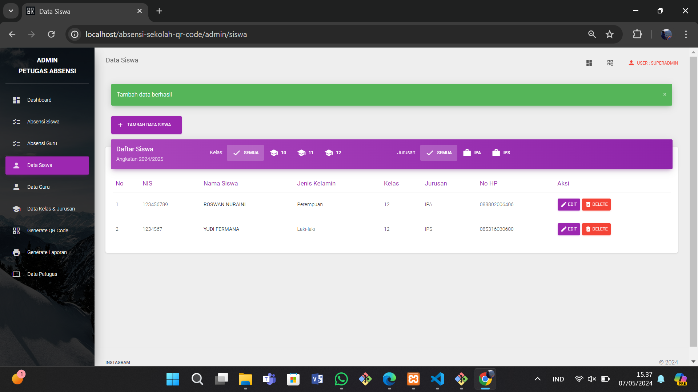

|       | Anggota |
| ----------- | ----------- |
|       | Muhammad Din Al Ayubi (312210293) |
|       | Muhammad Albedri (312210290) |
|       | Roswanda Nuraini (312210328) |
|       | Yudi Fermana (312210321) |
| Kelas   | TI.22.A.3        |
| Tugas   | UAS Pemograman Web        |
# Aplikasi Web Sistem Absensi Sekolah Berbasis QR Code


Aplikasi Web Sistem Absensi Sekolah Berbasis QR Code adalah sebuah proyek yang bertujuan untuk mengotomatisasi proses absensi di lingkungan sekolah menggunakan teknologi QR code. Aplikasi ini dikembangkan dengan menggunakan framework CodeIgniter 4 dan didesain untuk mempermudah pengelolaan dan pencatatan kehadiran siswa dan guru.

## Fitur Utama

- **QR Code scanner.** Setiap siswa/guru menunjukkan qr code kepada perangkat yang dilengkapi dengan kamera. Aplikasi akan memvalidasi QR code dan mencatat kehadiran siswa ke dalam database.
- **Login petugas.**
- **Dashboard petugas.** Petugas sekolah dapat dengan mudah memantau kehadiran siswa dalam periode waktu tertentu melalui tampilan yang disediakan.
- **QR Code generator.** Petugas yang sudah login akan men-generate qr code setiap siswa/guru secara otomatis. Setiap siswa akan diberikan QR code unik yang terkait dengan identitas siswa. QR code ini akan digunakan saat proses absensi.
- **Ubah data absen siswa/guru.** Petugas dapat mengubah data absensi setiap siswa/guru. Misalnya mengubah data kehadiran dari `tanpa keterangan` menjadi `sakit` atau `izin`.
- **Tambah, Ubah, Hapus(CRUD) data siswa/guru.**
- **Tambah, Ubah, Hapus(CRUD) data kelas.**
- **Lihat, Tambah, Ubah, Hapus(CRUD) data petugas.** (khusus petugas yang login sebagai **`superadmin`**).
- **Generate Laporan.** Generate laporan dalam bentuk pdf.

## Framework dan Library Yang Digunakan

- CodeIgniter 4
- [Material Dashboard Bootstrap 4](https://www.creative-tim.com/product/material-dashboard-bs4)
- [Myth Auth Library](https://github.com/lonnieezell/myth-auth)
- [Endroid QR Code Generator](https://github.com/endroid/qr-code)
- [ZXing JS QR Code Scanner](https://github.com/zxing-js/library)

## Screenshots

### Tampilan Halaman QR Scanner


### Tampilan Absen Masuk dan Pulang


### Tampilan Login Petugas


### Tampilan Dashboard Petugas


### Tampilan CRUD Data Absen

| Siswa (Dengan Data Kelas)                                                                                                   |                                                           Guru                                                           |
| --------------------------------------------------------------------------------------------------------------------------- | :----------------------------------------------------------------------------------------------------------------------: |
|  |  |

### Tampilan Ubah Data Kehadiran


### Tampilan CRUD Data Siswa & Guru

| Siswa                                                                                                                      |                                                           Guru                                                            |
| -------------------------------------------------------------------------------------------------------------------------- | :-----------------------------------------------------------------------------------------------------------------------: |
|  |  |

### Tampilan CRUD Data Kelas & Jurusan


### Tampilan Generate QR Code dan Generate Laporan

| Generate QR                                                                                                          |                                                      Generate Laporan                                                       |
| -------------------------------------------------------------------------------------------------------------------- | :-------------------------------------------------------------------------------------------------------------------------: |
|  |  |

## Cara Penggunaan

### Persyaratan

- [Composer](https://getcomposer.org/).
- PHP dan MySQL atau [XAMPP](https://www.apachefriends.org/download.html) versi 8.1+ dengan mengaktifkan extension `-intl` dan `-gd`.
- Pastikan perangkat memiliki kamera/webcam untuk menjalankan qr scanner. Bisa juga menggunakan kamera HP dengan bantuan software DroidCam.

### Instalasi

- Unduh dan impor kode proyek ini ke dalam direktori proyek anda (htdocs).
- Jika belum memiliki file `.env`, rename file `.env.example` menjadi `.env` atau jalankan perintah berikut:

```shell
# linux & macos, git bash
composer run-script setup-env
# windows cmd/powershell
composer run-script setup-env-win
```

- (Opsional) Konfigurasi file `.env` untuk mengatur parameter seperti koneksi database dan pengaturan lainnya sesuai dengan lingkungan pengembangan Anda.
- (Opsional) Ganti/replace logo sekolah di `public/assets/img/logo_sekolah.jpg`.
- (Opsional) Konfigurasi file `app/Config/App.php` untuk mengubah base url sesuai dengan nama folder project.
- Penting ⚠️. Install dependencies yang diperlukan dengan cara menjalankan perintah berikut di terminal:

```shell
composer install
```

- Buat database `db_absensi` di phpMyAdmin / mysql
- Penting ⚠️. Jalankan migrasi database untuk membuat struktur tabel yang diperlukan. Ketikkan perintah berikut di terminal:

```shell
php spark migrate --all
```

- Buka file `vendor/myth/auth/src/Config/Auth.php`. Lalu ubah kedua baris berikut:

```php
public $requireActivation = 'Myth\Auth\Authentication\Activators\EmailActivator';

public $activeResetter = 'Myth\Auth\Authentication\Resetters\EmailResetter';
```

- ubah value menjadi `null`:

```php
public $requireActivation = null;

public $activeResetter = null;
```

- (Opsional) Masih di file yang sama, ubah baris berikut:

```php
public $views = [
    'login'           => 'Myth\Auth\Views\login', // baris ini
    'register'        => 'Myth\Auth\Views\register',
    'forgot'          => 'Myth\Auth\Views\forgot',
    'reset'           => 'Myth\Auth\Views\reset',
    'emailForgot'     => 'Myth\Auth\Views\emails\forgot',
    'emailActivation' => 'Myth\Auth\Views\emails\activation',
];
```

menjadi:

```php
public $views = [
    'login'           => '\App\Views\admin\login', // menggunakan tampilan login custom
    'register'        => 'Myth\Auth\Views\register',
    'forgot'          => 'Myth\Auth\Views\forgot',
    'reset'           => 'Myth\Auth\Views\reset',
    'emailForgot'     => 'Myth\Auth\Views\emails\forgot',
    'emailActivation' => 'Myth\Auth\Views\emails\activation',
];
```

- Jalankan web server.
- Lalu jalankan aplikasi di browser.
- Login menggunakan krendensial superadmin:

```
username : superadmin
password : superadmin
```

Jika ingin mengubah email, username & password dari superadmin

Buka file `app\Database\Migrations\2023-08-18-000004_AddSuperadmin.php` lalu ubah & sesuaikan kode berikut:

```php
// INSERT INITIAL SUPERADMIN
$email = 'adminsuper@gmail.com';
$username = 'superadmin';
$password = 'superadmin';
```

- Izinkan akses kamera.

## Kesimpulan

Dengan aplikasi web sistem absensi sekolah berbasis QR code ini, diharapkan proses absensi di sekolah menjadi lebih efisien dan terotomatisasi. Proyek ini dapat diadaptasi dan dikembangkan lebih lanjut sesuai dengan kebutuhan dan persyaratan sekolah Anda.

Jangan lupa beri star...⭐

## Contributing

Kami menerima kontribusi dari komunitas terbuka untuk meningkatkan aplikasi ini. Jika Anda menemukan masalah, bug, atau memiliki saran untuk peningkatan, silakan buat issue baru dalam repositori ini atau ajukan pull request.

## Authors
| [Demo-on]() | [YouTube]() | [Laporan]()
- [mdinalayubi](https://www.github.com/mdinalayubi)
- [roswanda](https://www.github.com/roswanda11)
- [Albedri](https://www.github.com/Albedri211)
- [Yudifermana](https://www.github.com/Yudifermana)